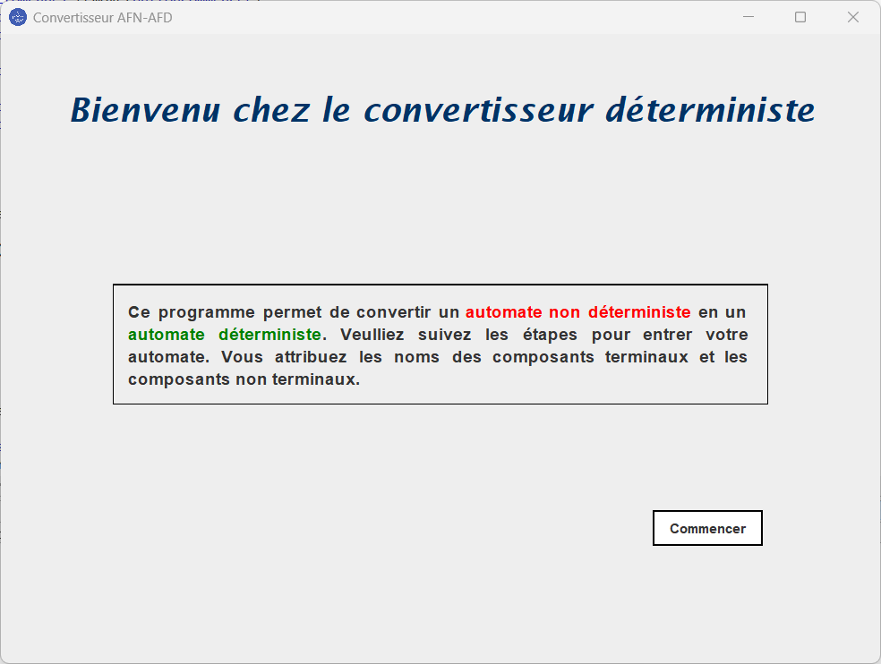
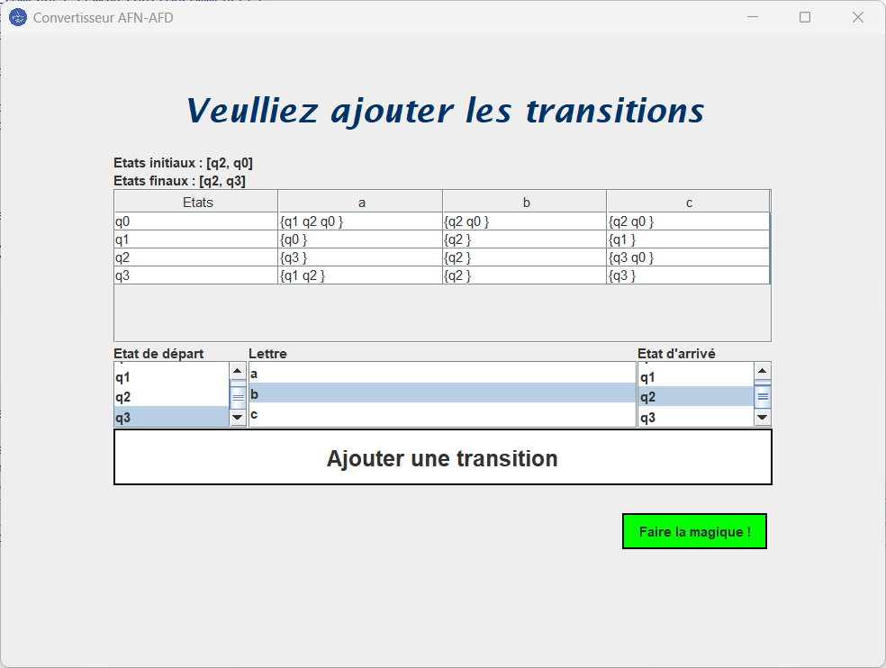

# AFN Determination Tool 🔁

A Java-based tool to convert a non-deterministic finite automaton (AFN) into a deterministic finite automaton (AFD), with a graphical interface built using Swing.

## 📘 Description

This tool was developed as part of a compilation techniques project at INSEA. It implements the theoretical process of determinization, transforming an AFN into an equivalent AFD while preserving the accepted language.

## 🎯 Features

- Define custom states, transitions, initial and final states
- Visual interface for creating and managing automata
- Support for non-deterministic transitions
- Automatic determinization algorithm
- Acceptance verification for input strings

## 🧠 Theory Behind

The tool is based on formal automata theory, and uses a composite state construction method to determinize AFNs:
- Composite state generation
- Transition set union
- Final state inference

## 🛠️ Technologies

- Java (Core + Swing)
- Object-Oriented Programming
- Custom data structures (HashMaps, HashSets)

## 📷 Screenshots




## 📚 Academic Context

- Developed by: Zakaria Douih & Abderrahmane Nait-El-Haj
- Supervised by: Mr. Adil Kabbaj
- Institution: INSEA – Department of Software & Data Engineering
- Date: January 2025

## 🚀 How to Run

```bash
javac Automate.java
java Main
